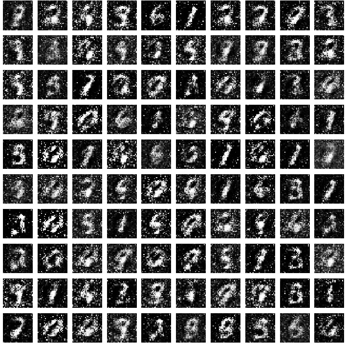
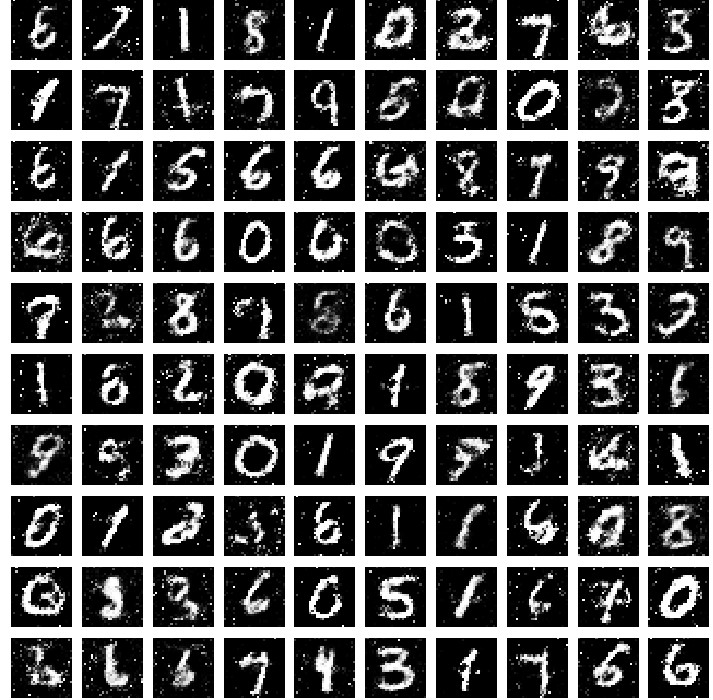
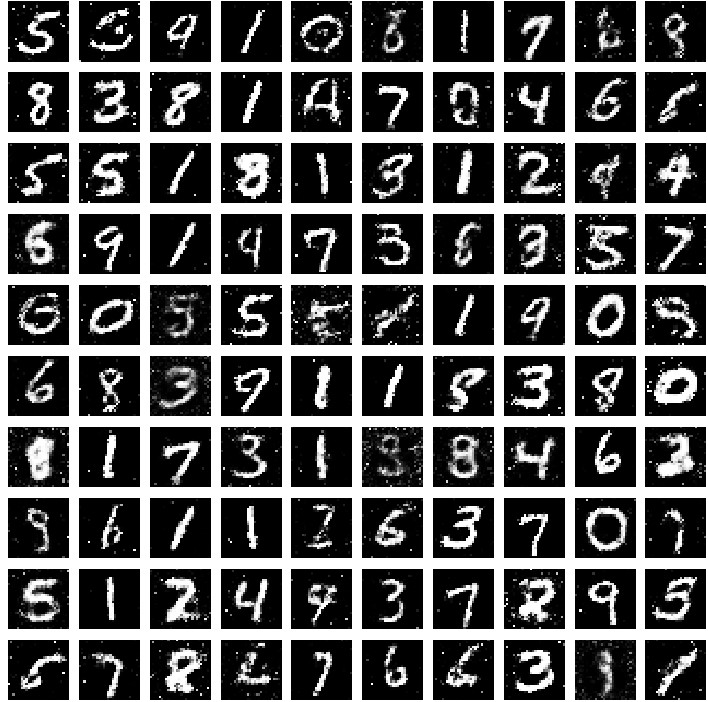

# Digit-Image-Generator-Using-Generative-Adversarial-Networks
This module can create images
that look like numeric digits, even though the images don’t belong to any real data. GANs achieve this level of realism by
pairing a generator, which learns to produce the target output, with a discriminator, which learns to distinguish true data from
the output of the generator. The generator tries to fool the discriminator, and the discriminator tries to keep from being fooled.

## INITIAL IMAGES GENERATED

## IMAGES GENERATED DURING INTERMEDIATE ITERATIONS

##mOST OPTIMAL IMAGES GENERATED

